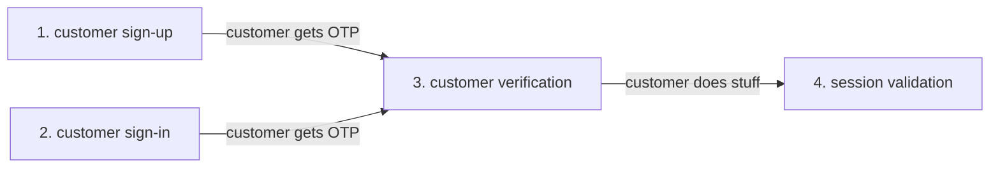
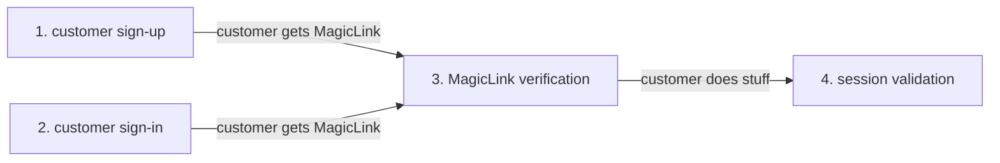

# ExpresSDK for Python

Use the Descope ExpresSDK for Python to quickly and easily add user authentication to your application or website. If you need a bit more background on how the ExpresSDKs work, [click here](/sdk/index.mdx).

The Descope ExpresSDK for Python supports 3.6 and above.

## ExpressStart with OTP Authentication

This section will show you how to implement user authentication using a one-time password (OTP). A typical four step flow for OTP authentictaion is shown below.



Decorators shown in the code below are valid for Python Flask.

### Prerequisites

Replace any instance of  `<ProjectID>` in the code below with your company's Project ID, which can be found in the [Descope console](https://app.descope.com).

* Run the following code in your project:

    These commands will add the Descope ExpresSDK for Python as a project dependency, and set the `DESCOPE_PROJECT_ID` variable to a valid \<ProjectID\>.

     ```code Python
    pip install Descope-Auth
    export DESCOPE_PROJECT_ID=<ProjectID>
     ```

* Import and initialize the ExpresSDK for Python client in your source code

    ```code Python
    from descope import DeliveryMethod, User, DescopeClient
    ```

### 1. Customer Sign-up

In your sign-up route for OTP (for example, `myapp.com/signup`) generate a sign-up request and send the OTP verification code via the selected OTP delivery method. In the example below an email is sent to "mytestmail@test.com". In additon, optional user data (for exmaple, a custom username in the code sample below) can be gathered during the sign-up process.

```code Python
user = User("newusername", "full name", "555-555-1212", "mytestmail@test.com")
descope_client.sign_up_otp(DeliveryMethod.EMAIL, "mytestmail@test.com, user)
```

### 2. Customer Sign-in
In your sign-in route for OTP (for exmaple, `myapp.com/login`) generate a sign-in request send the OTP verification code via the selected OTP delivery method. In the example below an email is sent to "mytestmail@test.com".

```code Python
descope_client.sign_in_otp(DeliveryMethod.EMAIL, "mytestemail@test.com")
}
```
```code Flask Decorator
@descope_signin_otp_by_email
```

### 3. Customer Verification


In your verify customer route for OTP (for example, `myapp.com/verify`) verify the OTP from either a customer sign-up or sign-in. The validate_session_request function call will write the necessary tokens and cookies to validate each session interaction.

```code Python
claims, tokens = validate_session_request(session_token: str, refresh_token: str)
```
```code Flask Decorator
@descope_verify_code_by_email
```

### 4. Session Validation

Session validation checks to see that the visitor to your website or application is who they say they are, by comparing the value in the validation variables against the session data that is already stored.

In the code below the validates the original session tokens and cookies (`session_token`) and validates the tokens and cookies from the client. ValidateSession returns true if the user is authorized, and false if the user is not authorized. In addition, the session will automatically be extended if the user is valid but the sesssion has expired by writing the updated tokens and cookies to the response writer (w).

```code Python
claims, tokens = descope_client.validate_session_request('session_token', 'refresh_token')
```
```code Flask Decorator
@descope_validate_auth
```

## ExpressStart with MagicLink Authentication

:::warning for the reviewer!
This is currenly a placeholder section only - to demonstrate how the framework can include addtional SDK flows.
:::

This section will help you implement user authentication using Magiclinks. etc. etc. The flow for MagicLinks is



### Prerequisites

Lorem ipsum dolor sit amet, consectetur adipiscing elit. Nunc laoreet diam vel dignissim posuere. Vestibulum consectetur ante justo, in pretium ligula sollicitudin ut.

### 1. do this

Sed porttitor eu metus vitae molestie. Sed sed erat risus. Donec eu tempor leo. In hac habitasse platea dictumst. Etiam ornare non tellus eget ultricies.

### 2. do that

Praesent a eros ut est fermentum egestas. Nulla eget leo diam. Vestibulum nec mi nisi. In finibus est in tellus sodales mattis. Etiam gravida nisl id arcu commodo malesuada.

## ExpressStart with Oauth

:::warning placeholder
placeholder for instanst-start OAuth example
:::

## ExpresStart for WebAuthn

:::warning placeholder
placeholder for instanst-start WebAuthn example
:::


## Unit Testing
Simplify your unit testing by using the predefined mocks and mock objects provided with the ExpresSDK.

```code python
python -m pytest tests/*
```

## License

The Descope ExpresSDK for Python is licensed for use under the terms and conditions of the [MIT license Agreement](https://github.com/descope/python-sdk/blob/main/LICENSE).

