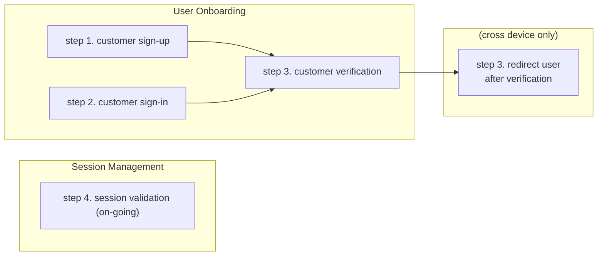

# Magiclink Authentication

A magic link is a one-time-use link sent to your user during the authentication process. Magic links can be sent to a user's email address or to their mobile phone as a text or WhatsApp message.

Magic links can be implemented to work "cross device", which lets a user sign-up/sign-in using one device while using a different device for magic link verification. As soon as the magic link is clicked, the user's session will be redirected to your desired page. For example, a user can sign in from a laptop using a browser and click the magic link received on WhatsApp on their cell phone. As soon as the user clicks the magic link on their cell phone, the browser session on their laptop will be redirected to your desired web page. Enabling cross device for magic links is a project setting in the [Descope console](https://app.descope.com).

## Overview

A typical method for implementing magic links requires two groups of tasks - user onboarding and session management:



* *User Onboarding*

    Step 1: (for new **user sign-up** only) Prompt user to enter their information, which must include an email or phone number that will be used for verification. Send that data to Descope using the `sign_up` function. The user will be sent the magic link by Descope, which you will verify in Step 3.

    Step 2: (for existing **user sign-in** only) Prompt user to enter their identity (typically an email address or phone number). Send that data to Descope using the `sign_in` function. The user will be sent the magic link by Descope, which you will verify in Step 3.

    Step 3: Verify the magic link using the `verify_code` function. Once the magic link is verified, the function will return a dict (`jwt_response` in the code sample) containing all the information you need to maintain an on-going verified online session with your user.
* *Session Management*

    Step 4: Validate the user session prior to implementing any business logic, to ensure your session is with an authenticated user and the ongoing session is still valid.

### Sample Code

For an in-depth explanation of the variables and dictionaries used by the sample code below, see the [SDK Dictionaries and Variables document](./deepdive.md).

For a complete sample code implmentation of magic links, see [sample code for magic link](../samples/magiclink_cross_device_sample_app.py).

## Install and configure the SDK

Run these commands in your project to add the Descope SDK as a project dependency and to set your \<ProjectID\>. Replace `<ProjectID>` with your Descope Project ID, which can be found in the [Descope console](https://app.descope.com).

```code
pip install Descope-Auth
export DESCOPE_PROJECT_ID=<ProjectID>
```

## Implement Magic Link (cross device)

Use this magic link implementation method if you have enabled cross-device authentication for your project in the [Descope console](https://app.descope.com).

See [deep dive](./deepdive.md) for an explanation of the vairables and dictinoaires used in the sample code provided.

### Import SDK into your code

Add the following to your source code.

```code
from descope import DeliveryMethod, DescopeClient
descope_client = DescopeClient()
```

### 1. User Sign-up

Call the `sign_up_cross_device` function from your sign-up route for magic links. In this example, the magic link will be sent by email to "mytestmail@test.com". `verify_uri` is the endpoint you implement to verify magic link tokens (in step 3). `ref_token` is a pointer to the current session, so you can redirect the user the magic link is verified (in step 3).

```Python
user = {"username": "joe", "full name": "Joe Person", "phone": "212-555-1212", "email": "mytestmail@test.com"}
verify_uri = "http://auth.yourcompany.com/api/verify_magiclink"
ref_token = descope_client.magiclink.sign_up_cross_device(DeliveryMethod.EMAIL, "mytestmail@test.com, verify_uri, user)
```

Use DeliveryMethod.PHONE to send the magic link as a text message, or DeliveryMethod.WHATSAPP to send the magic link as a WhatsApp message.

### 2. User Sign-in

Call the `sign-in_cross_device` function from your sign-in route for magic links. In this example, the verification will be sent by email to "mytestmail@test.com". `verify_uri` is the endpoint you implement to verify magic link tokens (step 3)

```Python
verify_uri = "http://auth.yourcompany.com/api/verify_magiclink"
ref_token = descope_client.magiclink.sign_in_cross_device(DeliveryMethod.EMAIL, "mytestemail@test.com", verify_uri)
```

Use DeliveryMethod.PHONE (for text message) or DeliveryMethod.WHATSAPP (for WhatsApp message), replacing the second argument with a valid phone number.

### 3. User Verification

Call the `verify` function from your verify magic link endpoint. The function call will write all the the necessary JWT tokens and claims and user information to `jwt_response` dictionary. The jwt_response is needed for session validation in step 4. 'token' is the URL parameter containing the magic link token, for example, https://auth.yourcompany.com/api/verify_magiclink?t=token.

`get_session(token)` is then called repeatedly until the user clicks the magic link URL they received.

```Python
# run this in a separate process/thread
descope_client.magiclink.verify(token)

# run this from your main process/thread
while not done:
    try:
        jwt_response = descope_client.magiclink.get_session(pending_ref)
        sleep(4)
        done = True
    except AuthException as e:
        if e.status_code == 401:   
            # user is not authorized
            done = True
```

### 4. Session Validation

Call the `validate_session_request` function from all endpoints that require an authenticated and validated user, immediately before the code that implements your business logic.

```Python
jwt_response = descope_client.validate_session_request(jwt_response[SESSION_TOKEN_NAME]["jwt"], jwt_response[REFRESH_SESSION_TOKEN_NAME]["jwt"])
```

## Implement Magic Link (not cross device)

Use this magic link implementation method if have not enabled cross-device authentication for this project in the [Descope console](https://app.descope.com).

See [deep dive](./deepdive.md) for an explanation of the vairables and dictinoaires used in the sample code provided.

### Import SDK into your code

Add the following to your source code.

```Python
from descope import DeliveryMethod, DescopeClient
descope_client = DescopeClient()
```

### 1. User Sign-up

Call the `sign_up` function from your sign-up route for magic link. In this example, the magic link will be sent by email to "mytestmail@test.com".  `verify_uri` is the endpoint you implement to verify magic link tokens (in step 3).

```Python
user = {"username": "joe", "full name": "Joe Person", "phone": "212-555-1212", "email": "mytestmail@test.com"}
verify_uri = "http://auth.yourcompany.com/api/verify_magiclink"
descope_client.magiclink.sign_up(DeliveryMethod.EMAIL, "mytestmail@test.com, verify_uri, user)
```

Use DeliveryMethod.PHONE to send the magic link as a text message, or DeliveryMethod.WHATSAPP to send the magic link as a WhatsApp message.

### 2. User Sign-in

Call the `sign-in` function from your sign-in route for magic links. In this example, the magic link will be sent by email to "mytestmail@test.com". `verify_uri` is the endpoint you implement to verify magic link tokens (in step 3).

```Python
verify_uri = "http://auth.yourcompany.com/api/verify_magiclink"
descope_client.magiclink.sign_in(DeliveryMethod.EMAIL, "mytestemail@test.com", verify_uri)
```

Use DeliveryMethod.PHONE (for text message) or DeliveryMethod.WHATSAPP (for WhatsApp message), replacing the second argument with a valid phone number.

### 3. User Verification

Call the `verify` function from your verify magic link endpoint. The function call will write all the the necessary JWT tokens and claims, and user information to `jwt_response` dictionary. The jwt_response is needed for session validation in step 4. 'token' is the URL parameter wctaining the token, for example http://auth.yourcompany.com/api/verify_magiclink?t=token.

```Python
jwt_response = descope_client.magiclink.verify(token) 
```

### 4. Session Validation

Call the `validate_session_request` function from all endpoints that require an authenticated and validated user, immediately before the code that implements your business logic.

```Python
jwt_response = descope_client.validate_session_request(jwt_response[SESSION_TOKEN_NAME]["jwt"], jwt_response[REFRESH_SESSION_TOKEN_NAME]["jwt"])
```

## Additional SDK Functions

### Update Phone Number

Call the `update_user_phone` function to add magic link verification phone for a user who only has magic link verification by email. You must always validate the user session before making changes to user information.

```python
descope_client.magiclink.update_user_phone(DeliveryMethod.PHONE, identifier, "212-555-1212", jwt_response[REFRESH_SESSION_TOKEN_NAME]["jwt"])
```

Use DeliveryMethod.WHATSAPP (for Whatspp message).

### Update Email

Call the `update_user_emil` function to add OTP verification by email for a user who only has OTP verification by phone. You must always validate the user session before making changes to user information. ???GUY is this really needed ???

```python
descope_client.magiclink.update_user_email(identifier, "mytestemail@test.com", jwt_response[REFRESH_SESSION_TOKEN_NAME]["jwt"])
```

### Unified Sign-up/Sign-in

Call the `sign_up_or_in` function to implement a unified method for users to both sign-up and sign-in. This function can be used when you only want to prompt for a phone or email from your user. If the phone/email is new, Descope will verify and then add the new user to your users list. If the phone/email exists in your user list, the sign-in process will continue as usual.

The phone or email will be used as the identifier.

* if cross device is enabled

    ```python
    verify_uri = "http://auth.yourcompany.com/api/verify_magiclink"
    descope_client.magiclink.sign_up_or_in_cross_device(DeliveryMethod.EMAIL, "mytestmail@test.com", verify_uri)
    ```
* if cross device is not enabled

    ```python
    verify_uri = "http://auth.yourcompany.com/api/verify_magiclink"
    descope_client.magiclink.sign_up_or_in(DeliveryMethod.EMAIL, "mytestmail@test.com", verify_uri)
    ```

Use DeliveryMethod.PHONE (for text message) or DeliveryMethod.WHATSAPP (for Whatspp message), replacing the second argument with a valid phone number.

### Logout All Sessions

Logout all sessions for a user.

```python
descope_client.logout(jwt_response[REFRESH_SESSION_TOKEN_NAME]["jwt"])
```
