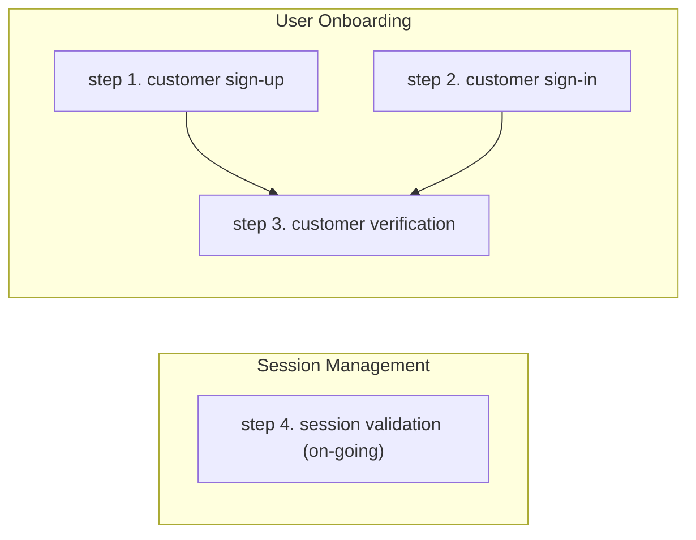

# OTP Authentication

A one-time password (OTP) is an automatically generated string that is used to authenticate a user for a single transaction or an on-going online session. The OTP can be sent to a user's email address or to their mobile phone as a text or WhatsApp message.

## Overview

A typical method for implementing one time passwords (OTP) requires two groups of tasks - user onboarding and session management:



* *User Onboarding* - sign-up/sign-in and then verify the authenticity of that user using OTP

  Step 1: (for new **user sign-up** only) - Prompt user to enter their information, which must include an email and/or phone number that will be used for verification. Send that data to Descope using the `sign_up` function. The user will be sent the OTP by Descope, which you will verify in Step 3.

  Step 2: (for existing **user sign-in** only) Prompt user to enter their identity (typically an email address or phone number). Send that data to Descope using the `sign_in` function. The user will be sent the OTP by Descope, which you will verify in Step 3.

  Step 3: (**user verification**) Verify the OTP using the `verify_code` function. Once the OTP is verified, the function will return a dict (`jwt_response` in the code sample) containing all the information you need to maintain an on-going verified online session with your user.

* *Session Management*

    Step 4: (**session validation**) Validate the user session prior to implementing any business logic, to ensure your session is with an authenticated user and the ongoing session is still valid.

### Sample Code

For an in-depth explanation of the variables and dictionaries used by the sample code below, see the [SDK Dictionaries and Variables document](./deepdive.md).

For a complete sample code implmentation of OTP, see [sample code for OTP.](../samples/otp_web_sample_app.py).

## Install the SDK

 Run these commands in your project to add the Descope SDK for Python as a project dependency and set your \<ProjectID\>. Replace `<ProjectID>` with your Descope Project ID, which can be found in the [Descope console](https://app.descope.com).

```code
pip install Descope-Auth
export DESCOPE_PROJECT_ID=<ProjectID>
```

## Implement OTP

### Import SDK

Add the following to your source code.

```code
from descope import DeliveryMethod, DescopeClient
descope_client = DescopeClient()
```

### 1. User Sign-up

Call the `sign_up` function from your sign-up route for OTP. In this example, the OTP verification will be sent by email to "mytestmail@test.com".

```Python
user = {"username": "joe", "full name": "Joe Person", "phone": "212-555-1212", "email": "mytestmail@test.com"}
descope_client.otp.sign_up(DeliveryMethod.EMAIL, "mytestmail@test.com, user)
```

Use DeliveryMethod.PHONE to send the OTP as a text message, or DeliveryMethod.WHATSAPP to send the OTP as a WhatsApp message.

### 2. User Sign-in

Call the `sign-in` function from your sign-in route for OTP. In this example, the OTP verification will be sent by email to "mytestmail@test.com".

```Python
descope_client.otp.sign_in(DeliveryMethod.EMAIL, "mytestemail@test.com")
```

Use DeliveryMethod.PHONE (for text message) or DeliveryMethod.WHATSAPP (for Whatspp message), replacing the second argument with a valid phone number.

### 3. User Verification

Call the `verify_code` function from your verify customer route for OTP. The function call will write all the the necessary JWT tokens and claims and user information to `jwt_response` dictionary. The jwt_response is needed for session validation in step 4.

```Python
jwt_response = descope_client.otp.verify_code(DeliveryMethod.EMAIL, "mytestemail@test.com", code) 
```

### 4. Session Validation

Call the `validate_session_request` function from all endpoints that require an authenticated and validated user, immediately before the code that implements your business logic.

```Python
jwt_response = descope_client.validate_session_request(jwt_response[SESSION_TOKEN_NAME]["jwt"], jwt_response[REFRESH_SESSION_TOKEN_NAME]["jwt"])
```

## Additional SDK Functions

The SDK implements these additional functions.

### Update Phone Number

Call the `update_user_phone` function to add OTP verification phone for a user who only has OTP verification by email.

```python
''' update the phone number '''
descope_client.otp.update_user_phone(DeliveryMethod.PHONE, identifier, "212-555-1212", jwt_response[REFRESH_SESSION_TOKEN_NAME]["jwt"])
```

Use DeliveryMethod.PHONE (for text message) or DeliveryMethod.WHATSAPP (for Whatspp message), replacing the second argument with a valid phone number.

### Update Email

Call the `update_user_emil` function to add OTP verification by email for a user who only has OTP verification by phone.

```python
descope_client.otp.update_user_email(identifier, "mytestemail@test.com", jwt_response[REFRESH_SESSION_TOKEN_NAME]["jwt"])
```

### Unified Sign-up/Sign-in

Call the `sign_up_or_in` function to implement a unified method for users to both sign-up and sign-in. This function can be used when you only want to prompt for a phone or email from your user. If the phone/email is new, Descope will verify and then add the new user to your users list. If the phone/email exists in your user list, the sign-in process will continue as usual.

The phone or email will be used as the identifier.

```python
descope_client.otp.sign_up_or_in(DeliveryMethod.EMAIL, "mytestmail@test.com")
```

Use DeliveryMethod.PHONE (for text message) or DeliveryMethod.WHATSAPP (for Whatspp message), replacing the second argument with a valid phone number.

### Logout All Sessions

Logout all sessions for a user.

```python
descope_client.logout(jwt_response[REFRESH_SESSION_TOKEN_NAME]["jwt"])
```
